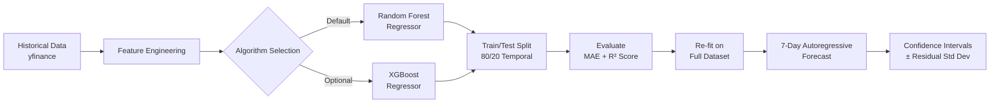
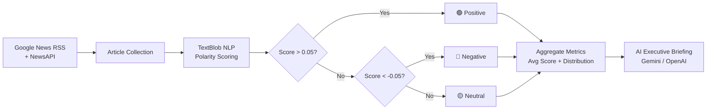
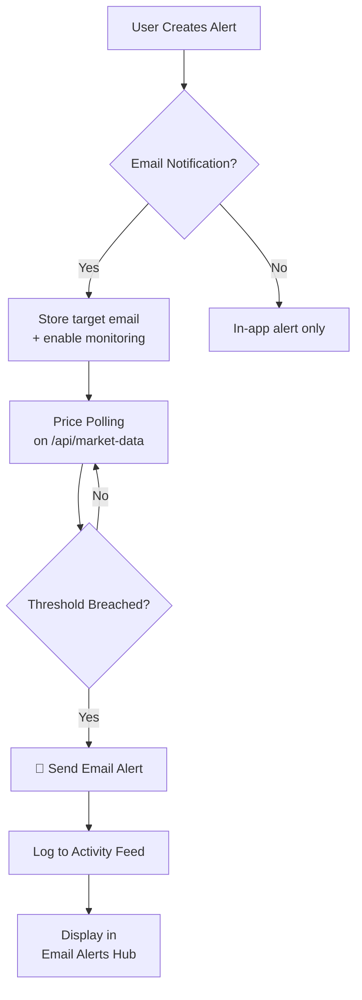

<div align="center">

# 🚀 MarketPulse AI

### Intelligent Financial Dashboard & Trading Intelligence Platform

[](https://python.org)
[](https://flask.palletsprojects.com)
[](https://plotly.com)
[](https://scikit-learn.org)
[](LICENSE)

**A premium, real-time financial intelligence platform powered by machine learning and AI.**
Track stocks & crypto, get ML-driven trade signals, analyze news sentiment, and receive smart price alerts — all from a single TradingView-inspired dashboard.

---

</div>

## ✨ Features at a Glance

| Feature | Description |
|:---|:---|
| 📊 **Live Market Dashboard** | Real-time candlestick charts with zoom, pan, and hover — inspired by TradingView |
| 🤖 **ML Prediction Engine** | 7-day price forecasts using Random Forest & XGBoost with confidence intervals |
| 📈 **Today's Trades** | Curated stock & crypto trade recommendations with entry/target/stop-loss levels |
| 📰 **Sentiment Analysis** | NLP-powered news sentiment scoring on live financial headlines |
| 🔔 **Smart Alerts** | Custom price alerts (above/below) with email notification support |
| 📧 **Email Alerts Hub** | Centralized dashboard for all email alert activity and history |
| 💬 **AI Chat Assistant** | Ask questions about any ticker — powered by Google Gemini / OpenAI |
| 💼 **Portfolio Analyzer** | Track holdings, P&L, allocation breakdown, and performance metrics |
| 🌐 **Market Correlation Network** | Interactive force-directed graph showing asset correlations |
| 🏢 **Investor Intelligence** | Institutional holder analysis and insider trading activity |
| 📄 **Document Viewer** | SEC filing and financial document analysis |
| 👤 **User Authentication** | Secure registration/login with role-based access (User & Admin) |
| 🛡️ **Admin Panel** | User management, activity logs, and system monitoring |

---

## 🏗️ Architecture

```
marketpulse-ai/
├── run.py                    # Flask application & all routes (1000+ lines)
├── config.py                 # Environment-aware configuration
├── wsgi.py                   # Gunicorn production entry point
├── requirements.txt          # Python dependencies
│
├── database/
│   ├── connection.py         # SQLAlchemy engine & session setup
│   └── models.py             # ORM models (Watchlist, Portfolio, Alert, User, ActivityLog)
│
├── services/
│   ├── market_data.py        # yfinance wrapper with caching & fallbacks
│   ├── prediction_model.py   # ML forecasting (Random Forest / XGBoost)
│   ├── sentiment_analyzer.py # TextBlob NLP + rule-based fallback
│   ├── news_service.py       # Google News RSS + NewsAPI integration
│   └── ai_service.py         # Gemini / OpenAI / local fallback for AI features
│
├── static/
│   ├── css/style.css         # Premium dark-theme UI (glassmorphism + gradients)
│   ├── js/dashboard.js       # Plotly charts, alerts, watchlist, trade logic
│   ├── js/chat.js            # AI chat assistant interface
│   └── images/logo.png       # App branding
│
└── templates/                # 14 Jinja2 HTML templates
    ├── base.html             # Master layout with sidebar navigation
    ├── overview.html          # Main dashboard with candlestick + prediction charts
    ├── todays_trades.html     # Separated stock & crypto trade recommendations
    ├── predictions.html       # ML prediction engine interface
    ├── sentiment.html         # News sentiment analysis
    ├── news.html              # Financial news feed
    ├── portfolio.html         # Portfolio management & analytics
    ├── network.html           # Asset correlation network graph
    ├── investors.html         # Institutional investor intelligence
    ├── email_alerts.html      # Email alert monitoring hub
    ├── document_viewer.html   # SEC filing viewer
    ├── login.html             # User authentication
    ├── register.html          # User registration
    └── admin.html             # Admin control panel
```

---

## 🧠 How the ML Engine Works

MarketPulse AI uses a **time-series regression pipeline** trained on historical market data to forecast future prices:



### Engineered Features
| Feature | Description |
|:---|:---|
| `lag_1`, `lag_2`, `lag_3` | Previous 1, 2, and 3 day closing prices |
| `ma_5`, `ma_10` | 5-day and 10-day moving averages |
| `daily_return` | Day-over-day percentage change |
| `vol_ma_5` | 5-day volume moving average |

### Model Output
- **7-day price forecast** with upper/lower confidence bounds
- **R² score** and **MAE** evaluation metrics
- **Feature importance** rankings
- **Buy/Sell/Hold signal** derived from predicted price trajectory

---

## 📰 Sentiment Analysis Pipeline



Each news article is scored between **-1.0** (extremely bearish) and **+1.0** (extremely bullish), with aggregate metrics displayed per asset.

---

## 🔔 Smart Alerts System

- **Price Above** — Triggers when an asset's price crosses above your target
- **Price Below** — Triggers when an asset's price drops below your threshold
- **Email Notifications** — Optionally receive alerts at a custom email address
- **Email Alerts Hub** — View all active monitors and historical alert activity in one place



---

## 💬 AI Chat Assistant

The built-in conversational AI assistant can answer questions about any ticker in your watchlist:

- *"What's the outlook for TSLA this week?"*
- *"Explain BTC's recent price action"*
- *"Should I hold AAPL right now?"*

**Powered by a 3-tier fallback system:**
1. 🥇 **Google Gemini** (`gemini-1.5-flash`) — Primary, fastest
2. 🥈 **OpenAI** (`gpt-3.5-turbo`) — Secondary fallback
3. 🥉 **Local Rule-Based** — Works offline with no API keys

---

## 🚀 Quick Start

### Prerequisites
- **Python 3.10+**
- **pip** (Python package manager)

### Installation

```bash
# Clone the repository
git clone https://github.com/bharanboddu/MarketPulse-AI.git
cd MarketPulse-AI

# Create a virtual environment
python -m venv .venv

# Activate (Windows)
.venv\Scripts\activate

# Activate (macOS/Linux)
source .venv/bin/activate

# Install dependencies
pip install -r requirements.txt

# Configure environment variables
cp .env.template .env
# Edit .env with your API keys (optional)

# Run the application
python run.py
```

Open your browser at **http://localhost:5000** 🎉

---

## ⚙️ Configuration

All configuration is managed through environment variables in the `.env` file:

| Variable | Required | Default | Description |
|:---|:---:|:---|:---|
| `FLASK_SECRET_KEY` | ✅ | Auto-generated | Session encryption key |
| `DATABASE_URL` | ❌ | SQLite (local) | PostgreSQL connection string for production |
| `GEMINI_API_KEY` | ❌ | — | [Google AI Studio](https://aistudio.google.com) API key for AI features |
| `OPENAI_API_KEY` | ❌ | — | OpenAI API key (fallback for AI features) |
| `NEWS_API_KEY` | ❌ | — | [NewsAPI](https://newsapi.org) key (Google RSS used as free default) |

> **Note:** The app works fully without any API keys — AI features gracefully fall back to local rule-based analysis.

---

## 🛠️ Tech Stack

<table>
<tr>
<td align="center" width="150">

**Backend**
</td>
<td align="center" width="150">

**Frontend**
</td>
<td align="center" width="150">

**ML / AI**
</td>
<td align="center" width="150">

**Data**
</td>
<td align="center" width="150">

**Database**
</td>
</tr>
<tr>
<td align="center">

Flask 3.0+
Gunicorn
SQLAlchemy
</td>
<td align="center">

Plotly.js
CSS3 (Dark Theme)
Vanilla JavaScript
</td>
<td align="center">

scikit-learn
XGBoost
TextBlob (NLP)
Google Gemini
OpenAI
</td>
<td align="center">

yfinance
Google News RSS
NewsAPI
</td>
<td align="center">

SQLite (Dev)
PostgreSQL (Prod)
</td>
</tr>
</table>

---

## 📱 Pages & Navigation

| Page | Route | Description |
|:---|:---|:---|
| 🏠 Dashboard Overview | `/overview` | Candlestick chart, prediction overlay, key metrics |
| 📈 Today's Trades | `/todays-trades` | Separated stock & crypto trade recommendations |
| 🔮 Prediction Engine | `/predictions` | ML model configuration and forecasting |
| 📰 News Feed | `/news` | Aggregated financial news with source links |
| 💭 Sentiment Analysis | `/sentiment` | NLP sentiment breakdown per asset |
| 💼 Portfolio | `/portfolio` | Holdings management and P&L tracking |
| 🌐 Market Network | `/market-network` | Force-directed correlation graph |
| 🏢 Investor Intel | `/investors` | Institutional and insider activity |
| 📧 Email Alerts | `/email-alerts` | Alert notification history and active monitors |
| 📄 Documents | `/documents` | SEC filing viewer |
| ⚙️ Admin Panel | `/admin` | User management and system logs |

---

## 🔒 Security

- **Password Hashing** — Werkzeug's `generate_password_hash` / `check_password_hash`
- **Session Management** — Flask's secure session cookies
- **Role-Based Access** — Admin vs. User roles with route protection
- **Activity Logging** — All user actions are logged with timestamps and IP addresses
- **Environment Secrets** — API keys stored in `.env`, never committed to Git

---

## 📊 Supported Assets

### Stocks
AAPL · TSLA · MSFT · NVDA · GOOGL · AMZN · META · NFLX · AMD · INTC · PYPL · COIN — and any valid ticker symbol on Yahoo Finance

### Crypto
BTC · ETH · SOL · ADA · DOT · XRP · DOGE — with automatic `-USD` pair mapping

---

## 🤝 Contributing

1. Fork the repository
2. Create your feature branch (`git checkout -b feature/amazing-feature`)
3. Commit your changes (`git commit -m 'Add amazing feature'`)
4. Push to the branch (`git push origin feature/amazing-feature`)
5. Open a Pull Request

---

## 📄 License

This project is licensed under the MIT License — see the [LICENSE](LICENSE) file for details.

---

<div align="center">


⭐ Star this repo if you find it useful!

</div>
